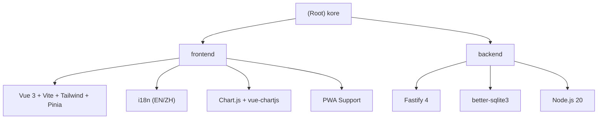

# CLAUDE.md

This file provides guidance to Claude Code (claude.ai/code) when working with code in this repository.

## Change Log

| Date | Changes |
|------|---------|
| 2026-05-17 | Enhanced Module Index with Frontend Views; updated Mermaid diagram |
| 2026-04-28 | Added Mobile/PWA support documentation; i18n store (EN/ZH) |
| 2026-04-28 | Initial CLAUDE.md created |

---

## Project Overview

**kore** is a self-hosted AI API gateway/reverse proxy that sits between AI applications and API providers. It provides failover, load balancing, usage quotas, and a Vue-based dashboard.

```
Downstream App → kore (/v1/chat/completions) → OpenAI/Claude/DeepSeek/...
```

---

## Architecture Overview



---

## Module Index

| Module | Path | Responsibility |
|--------|------|----------------|
| **Frontend** | `frontend/` | Vue 3 SPA with Tailwind CSS, Pinia stores, i18n support |
| **Backend** | `src/` | Fastify API server, provider scheduling, fault pool management |
| **Routes** | `src/routes/` | API endpoints (auth, providers, strategies, keys, logs, dashboard, settings, status, proxy) |
| **Services** | `src/services/` | Business logic (scheduler, fault-pool, geo, provider, strategy, proxy, log, dashboard) |
| **Database** | `src/db/` | SQLite connection, AES-256-GCM encryption |
| **Frontend Views** | `frontend/src/views/` | Page components (Dashboard, Providers, Strategies, Logs, Settings, Login, Setup) |
| **Frontend Stores** | `frontend/src/stores/` | State management (api.ts, i18n.ts) |

### Frontend Views Detail

| View | File | Purpose |
|------|------|---------|
| DashboardView | `frontend/src/views/DashboardView.vue` | Stats, charts, fault pool status, recent requests |
| ProvidersView | `frontend/src/views/ProvidersView.vue` | Provider CRUD, connectivity testing |
| StrategiesView | `frontend/src/views/StrategiesView.vue` | Strategy CRUD, provider selection, cURL test |
| LogsView | `frontend/src/views/LogsView.vue` | Request log query with filters |
| SettingsView | `frontend/src/views/SettingsView.vue` | System settings, API keys, data management |
| LoginView | `frontend/src/views/LoginView.vue` | Admin login page |
| SetupView | `frontend/src/views/SetupView.vue` | First-time admin account setup |

### Backend Routes Detail

| Route File | Prefix | Purpose |
|------------|--------|---------|
| `auth.routes.ts` | `/api/auth` | Admin login, JWT generation (setup mode: no auth required) |
| `provider.routes.ts` | `/api/providers` | Provider CRUD + connectivity testing |
| `strategy.routes.ts` | `/api/strategies` | Strategy CRUD |
| `apikey.routes.ts` | `/api/keys` | API key management |
| `proxy.routes.ts` | `/api/proxy` | Proxy configuration |
| `log.routes.ts` | `/api/logs` | Log queries |
| `dashboard.routes.ts` | `/api/dashboard` | Dashboard aggregated stats |
| `status.routes.ts` | `/api/status` | Fault pool status |
| `settings.routes.ts` | `/api/settings` | System settings |

### Backend Services Detail

| Service | File | Responsibility |
|---------|------|----------------|
| Scheduler | `scheduler.service.ts` | Provider selection (priority/round-robin) |
| Fault Pool | `fault-pool.service.ts` | Tracks failed providers, runs periodic health checks |
| Provider | `provider.service.ts` | CRUD for providers, manages status (normal/fault/throttled) |
| Strategy | `strategy.service.ts` | CRUD for strategies, manages strategy-provider mappings |
| Proxy | `proxy.service.ts` | Handles HTTP/SOCKS5 proxy forwarding |
| Geo | `geo.service.ts` | Async GeoIP resolution with /24 IPv4 and /64 IPv6 prefix caching |
| Log | `log.service.ts` | Request logging with token tracking |
| Dashboard | `dashboard.service.ts` | Aggregated statistics for dashboard |

---

## Commands

```bash
# Backend development (watch mode with tsx)
npm run dev

# Build TypeScript backend
npm run build

# Start production server
npm start

# Frontend (from frontend/ directory)
cd frontend && npm run dev      # Dev server
cd frontend && npm run build    # Production build
```

**Important:** Frontend must be built before `npm start` in production. The dev server (`npm run dev`) only starts the backend; frontend is served separately during development.

---

## Mobile / PWA Support

### PWA Configuration

| File | Purpose |
|------|---------|
| `frontend/public/manifest.json` | PWA manifest (standalone display, portrait orientation) |
| `frontend/index.html` | PWA meta tags (apple-mobile-web-app-*, viewport-fit=cover) |
| `frontend/public/icon.svg` | App icon |

### Mobile UI Features

- **Responsive Breakpoint**: `md` (768px) - mobile below, desktop above
- **Mobile Header**: Sticky top header with hamburger menu (visible on mobile only)
- **Mobile Bottom Navigation**: Fixed bottom nav bar with safe-area-inset-bottom support
- **Desktop Sidebar**: Fixed left sidebar (hidden on mobile)
- **Safe Area**: CSS `padding-bottom: env(safe-area-inset-bottom)` applied globally

### Mobile-Specific CSS

Located in `frontend/src/assets/main.css`:
```css
/* Safe area padding for bottom nav */
.pb-safe { padding-bottom: max(0.5rem, env(safe-area-inset-bottom)); }

/* Mobile modal full-width */
@media (max-width: 640px) {
  .modal-mobile-full {
    @apply !max-w-full mx-0 rounded-none h-full max-h-full;
  }
}
```

### i18n (Internationalization)

- Store: `frontend/src/stores/i18n.ts`
- Languages: English (`en`) and Chinese (`zh`)
- Storage key: `akdn_lang` in localStorage
- All UI strings use `t('key')` function from `useI18n()` hook

---

## Core Request Flow

1. Client sends request to `/v1/chat/completions` with Bearer token (`kore-xxxx`)
2. `src/routes/apikey.routes.ts` validates the API key → finds linked strategy
3. `src/services/scheduler.service.ts` selects a provider (priority or round-robin, skipping fault/throttled)
4. `src/utils/proxy-fetch.ts` forwards the request through the provider's proxy (if configured)
5. Response is streamed back; token usage and GeoIP are logged

---

## Database Schema (SQLite)

- `providers` — API provider configs (encrypted API keys, base_url, model_id, proxy_url, status)
- `strategies` — Routing strategies with mode (priority/round_robin) and token limits
- `strategy_providers` — Many-to-many mapping of strategy → provider with priority
- `api_keys` — Downstream API keys (`kore-xxxx`) linked to strategies
- `logs` — Request log with token usage, latency, client IP/country
- `ip_geo_cache` — GeoIP lookup cache with 7-day TTL

---

## API Routes

| Route | Auth | Purpose |
|-------|------|---------|
| `/api/auth/*` | None (setup) | Admin login, JWT generation |
| `/api/providers/*` | JWT | Provider CRUD + connectivity testing |
| `/api/strategies/*` | JWT | Strategy CRUD |
| `/api/keys/*` | JWT | API key management |
| `/api/proxy/*` | JWT | Proxy configuration |
| `/api/logs` | JWT | Log queries |
| `/api/dashboard/*` | JWT | Dashboard aggregated stats |
| `/api/status/*` | JWT | Fault pool status |
| `/api/settings/*` | JWT | System settings |
| `/v1/chat/completions` | `kore-xxxx` token | Main proxy endpoint |
| `/v1/models` | `kore-xxxx` token | Model list |

---

## Provider API Types

Providers can use different API types (set in `api_type` field):
- `openai-completions` — Standard `/v1/chat/completions`
- `anthropic-messages` — Anthropic-compatible `/v1/messages` endpoint

---

## Proxy Support

`proxy-fetch.ts` supports:
- HTTP proxy (`http://host:port`)
- HTTPS proxy
- SOCKS5 proxy (`socks5://host:port`)

---

## Encryption

API keys stored in SQLite are encrypted with AES-256-GCM (`src/db/encrypt.ts`). Encryption key is auto-generated on first run and persisted in `./data/.kore-keys.json`.

---

## Frontend Stack

Vue 3 + Vite + Tailwind CSS + Pinia + Chart.js + vue-chartjs + i18n (EN/ZH). Located in `frontend/` directory.

### Key Frontend Files

| File | Purpose |
|------|---------|
| `frontend/src/App.vue` | Root component with responsive layout (mobile/desktop) |
| `frontend/src/stores/i18n.ts` | Internationalization (EN/ZH) |
| `frontend/src/stores/api.ts` | API client with auth token handling |
| `frontend/src/assets/main.css` | Tailwind base + safe-area-inset-bottom |

---

## Testing Strategy

(No dedicated test files detected. Manual testing via dashboard UI.)

---

## Coding Standards

- TypeScript strict mode
- Vue 3 Composition API with `<script setup>`
- Tailwind CSS with custom theme (primary blue, dark palette)
- Pinia stores for state management
- i18n for all user-facing strings
